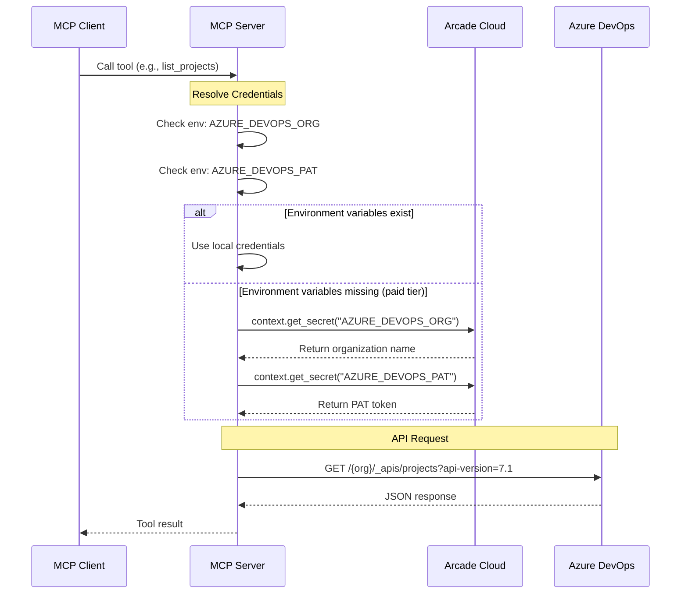
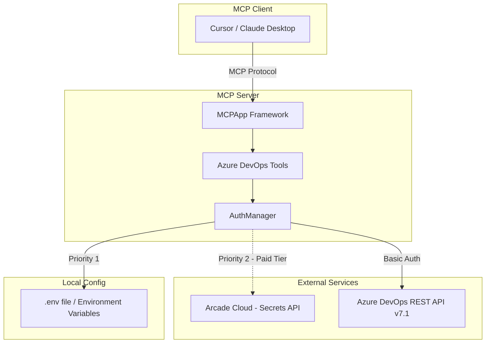

# arcade-azure-devops-mcp

An MCP server for Azure DevOps built with [Arcade.dev](https://arcade.dev). Enables AI assistants to interact with Azure DevOps projects, work items, repositories, pipelines, wikis, and more.

## Features

**21 tools** covering:
- **Core**: List projects, teams, search identities
- **Work Items**: Get, create, update, query work items; add comments
- **Repositories**: List repos, branches, pull requests; create PRs
- **Pipelines**: List definitions, builds; queue builds; run pipelines
- **Wikis**: List wikis, get wiki pages
- **Search**: Search code across repositories

## Quick Start

### 1. Install dependencies

```bash
uv sync
```

### 2. Configure credentials

You have two options for providing Azure DevOps credentials:

#### Option A: Environment Variables (`.env` file)

Copy the example environment file and add your credentials:

```bash
cp .env.example .env
```

Edit `.env`:

```env
AZURE_DEVOPS_ORG=your-organization-name
AZURE_DEVOPS_PAT=your-personal-access-token
```

#### Option B: Arcade Secrets (recommended for production)

If no `.env` file or environment variables are found, the server automatically falls back to **Arcade Secrets**. This is ideal for:
- Publishing to the Arcade marketplace
- Sharing the toolkit without exposing credentials
- Production deployments via Arcade Deploy

**Configure secrets in Arcade:**

```bash
# Login to Arcade
arcade login

# Set your secrets
arcade secrets set AZURE_DEVOPS_ORG "your-organization-name"
arcade secrets set AZURE_DEVOPS_PAT "your-personal-access-token"
```

Or configure via the [Arcade Dashboard](https://arcade.dev/dashboard).

**How it works:**
1. Server checks for environment variables first
2. If not found, requests secrets from Arcade Cloud via `context.get_secret()`
3. Arcade prompts user to authorize secret access (first time only)

### 3. Create a Personal Access Token (PAT)

1. Go to `https://dev.azure.com/{your-org}/_usersSettings/tokens`
2. Click "New Token"
3. Select scopes: Code (Read/Write), Work Items (Read/Write), Build (Read/Execute), Wiki (Read/Write)
4. Copy the token

### 4. Run the MCP Server

```bash
# stdio transport (default) - for Claude Desktop, CLI tools
uv run server.py stdio

# http transport - for Cursor, VS Code
uv run server.py http
```

For HTTP transport, view the API docs at http://127.0.0.1:8000/docs

## Configure MCP Clients

### Cursor IDE

```bash
arcade configure cursor
```

Or manually add to `.cursor/mcp.json`:

**With environment variables:**
```json
{
  "mcpServers": {
    "azure-devops": {
      "command": "uv",
      "args": ["run", "server.py", "stdio"],
      "cwd": "/path/to/arcade-azure-devops-mcp",
      "env": {
        "AZURE_DEVOPS_ORG": "your-org",
        "AZURE_DEVOPS_PAT": "your-pat"
      }
    }
  }
}
```

**With Arcade Secrets (no local credentials):**
```json
{
  "mcpServers": {
    "azure-devops": {
      "command": "uv",
      "args": ["run", "server.py", "stdio"],
      "cwd": "/path/to/arcade-azure-devops-mcp"
    }
  }
}
```

### VS Code

```bash
arcade configure vscode
```

### Claude Desktop

```bash
arcade configure claude
```

## Available Tools

| Category | Tool | Description |
|----------|------|-------------|
| **Core** | `list_projects` | List all projects in the organization |
| | `get_project` | Get project details |
| | `list_teams` | List teams in a project |
| | `search_identities` | Search for users/groups |
| **Work Items** | `get_work_item` | Get a work item by ID |
| | `create_work_item` | Create a new work item |
| | `update_work_item` | Update an existing work item |
| | `run_work_item_query` | Run a WIQL query |
| | `my_work_items` | Get work items assigned to you |
| | `add_work_item_comment` | Add a comment to a work item |
| **Repos** | `list_repositories` | List Git repositories |
| | `list_branches` | List branches in a repository |
| | `list_pull_requests` | List pull requests |
| | `create_pull_request` | Create a new PR |
| **Pipelines** | `list_build_definitions` | List pipeline definitions |
| | `list_builds` | List builds |
| | `queue_build` | Queue a new build |
| | `run_pipeline` | Start a pipeline run |
| **Wikis** | `list_wikis` | List wikis |
| | `get_wiki_page` | Get wiki page content |
| **Search** | `search_code` | Search code across repositories |

## Architecture

### Request Flow

```
┌────────────┐      ┌────────────┐      ┌──────────────┐      ┌─────────────┐
│ MCP Client │      │ MCP Server │      │ Arcade Cloud │      │ Azure DevOps│
└─────┬──────┘      └─────┬──────┘      └──────┬───────┘      └──────┬──────┘
      │                   │                    │                     │
      │  Call tool        │                    │                     │
      │──────────────────>│                    │                     │
      │                   │                    │                     │
      │                   │ Check env vars     │                     │
      │                   │◄──────────────────►│                     │
      │                   │                    │                     │
      │                   │ [If env vars missing - paid tier]        │
      │                   │ get_secret()       │                     │
      │                   │───────────────────>│                     │
      │                   │<───────────────────│                     │
      │                   │                    │                     │
      │                   │ API Request (Basic Auth)                 │
      │                   │─────────────────────────────────────────>│
      │                   │<─────────────────────────────────────────│
      │                   │                    │                     │
      │  Tool result      │                    │                     │
      │<──────────────────│                    │                     │
      │                   │                    │                     │
```

<details>
<summary>View Mermaid diagram (for GitHub/GitLab)</summary>



</details>

### Component Overview

```
┌─────────────────────────────────────────────────────────────────────────────┐
│                              MCP CLIENT                                     │
│                         (Cursor / Claude Desktop)                           │
└─────────────────────────────────┬───────────────────────────────────────────┘
                                  │ MCP Protocol (stdio/http)
                                  ▼
┌─────────────────────────────────────────────────────────────────────────────┐
│                              MCP SERVER                                     │
│  ┌─────────────────┐  ┌──────────────────┐  ┌─────────────────────────┐    │
│  │  MCPApp         │  │  Azure DevOps    │  │  AuthManager            │    │
│  │  Framework      │──│  Tools (21)      │──│  (credential resolver)  │    │
│  └─────────────────┘  └──────────────────┘  └───────────┬─────────────┘    │
└─────────────────────────────────────────────────────────┼───────────────────┘
                                                          │
                        ┌─────────────────────────────────┼─────────────────┐
                        │                                 │                 │
                        ▼ [Priority 1]                    ▼ [Priority 2]    │
          ┌─────────────────────────┐       ┌───────────────────────┐       │
          │  Local .env /           │       │  Arcade Cloud         │       │
          │  Environment Variables  │       │  (Secrets API)        │       │
          └─────────────────────────┘       │  [Paid tier only]     │       │
                                            └───────────────────────┘       │
                                                                            │
                                                          ┌─────────────────┘
                                                          ▼
                                            ┌───────────────────────┐
                                            │  Azure DevOps         │
                                            │  REST API v7.1        │
                                            └───────────────────────┘
```

<details>
<summary>View Mermaid diagram (for GitHub/GitLab)</summary>



</details>

### Credential Resolution Priority

1. **Environment variables** (`.env` file or system env) - checked first
2. **Arcade Cloud secrets** - fallback if env vars not found (requires paid Arcade tier)

## Project Structure

```
arcade-azure-devops-mcp/
├── server.py                  # MCP server entry point with all tools
├── arcade_azure_devops_mcp/   # Azure DevOps client library
│   ├── __init__.py
│   ├── client.py              # REST API client (httpx)
│   ├── models.py              # Pydantic models
│   └── auth/                  # Authentication
│       ├── __init__.py
│       ├── manager.py         # Credential management (env + Arcade secrets)
│       └── oauth.py           # OAuth/Azure AD (optional)
├── pyproject.toml             # Dependencies & entry points
├── .env.example               # Environment template
└── README.md
```

## Development

```bash
# Install with dev dependencies
uv sync --all-extras

# Run tests
uv run pytest
```

## Publishing to Arcade

To publish this toolkit to the Arcade marketplace:

```bash
# Ensure pyproject.toml has correct entry points
arcade publish
```

Users can then install via:
```bash
arcade install arcade-azure-devops-mcp
```

## License

MIT

## Links

- [Arcade.dev Documentation](https://docs.arcade.dev)
- [Azure DevOps REST API](https://docs.microsoft.com/en-us/rest/api/azure/devops)
- [MCP Specification](https://modelcontextprotocol.io)
